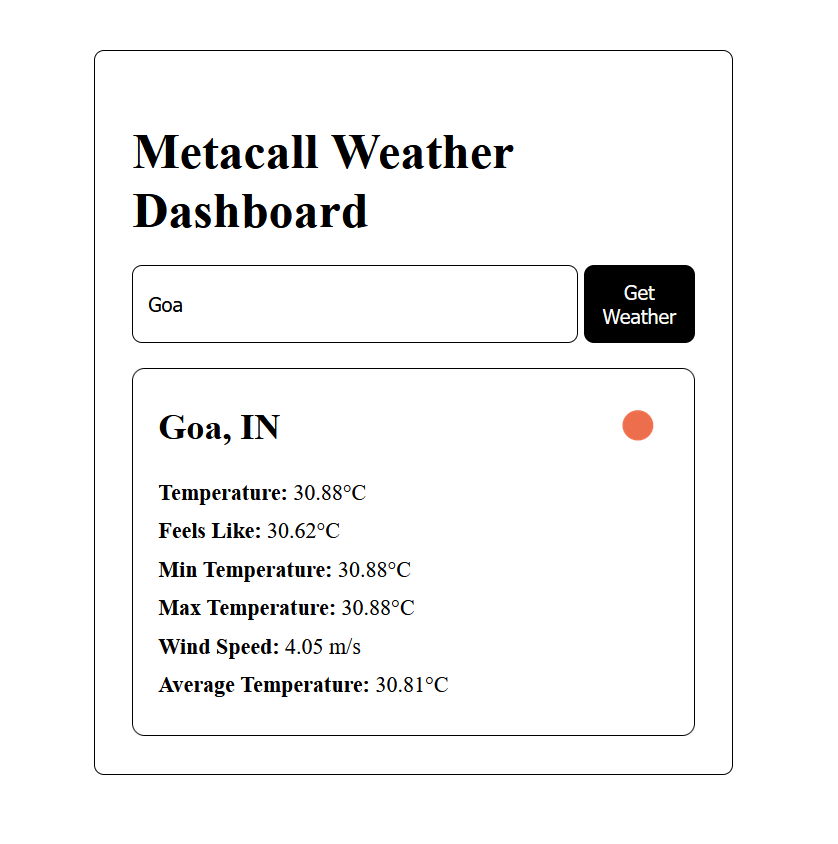
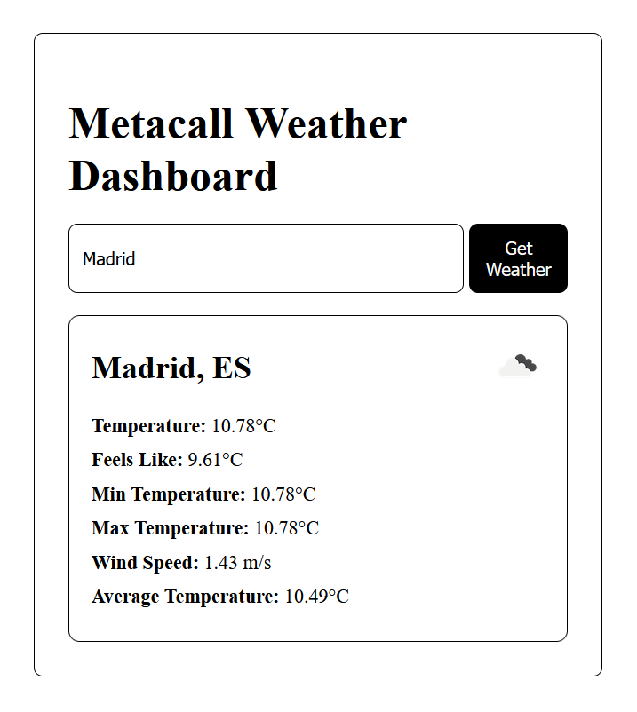

# Metacall Weather Dashboard

A simple Weather Dashboard that uses Python, Node.js, and VueJs. It fetches weather data from Openweather API using nodejs, calculate the average temperature using python and displays it on the frontend.

<div style="display: flex; justify-content: space-between;">
  
  
</div>

## Project Structure

- `backend/`: Contains the Node.js backend code
- `frontend/`: Contains the Vue.js frontend code

## Prerequisites

Make sure you have the following installed on your system:
- metacall [install](https://github.com/metacall/install)
- Node.js
- npm

## Getting Started

### Step 1: Install Dependencies

1. **Backend Setup:**

   Navigate to the `backend/` directory and install the necessary dependencies:

   ```bash
   cd backend
   metacall npm install express
   metacall npm install cors
   metacall npm install axios
   ```

2. **Frontend Setup:**

   Navigate to the `frontend/` directory and install the necessary frontend dependencies:

   ```bash
   cd frontend
   npm install
   ```

### Step 2: Run the Application

1. **Start the Backend:**

   Go to the `backend/` folder and run the backend server:

   ```bash
   cd backend
   metacall main.js
   ```

   This will start the backend server which listens for weather data requests.

2. **Start the Frontend:**

   In the `frontend/` folder, run the Vue.js development server:

   ```bash
   cd frontend
   npm run serve
   ```
